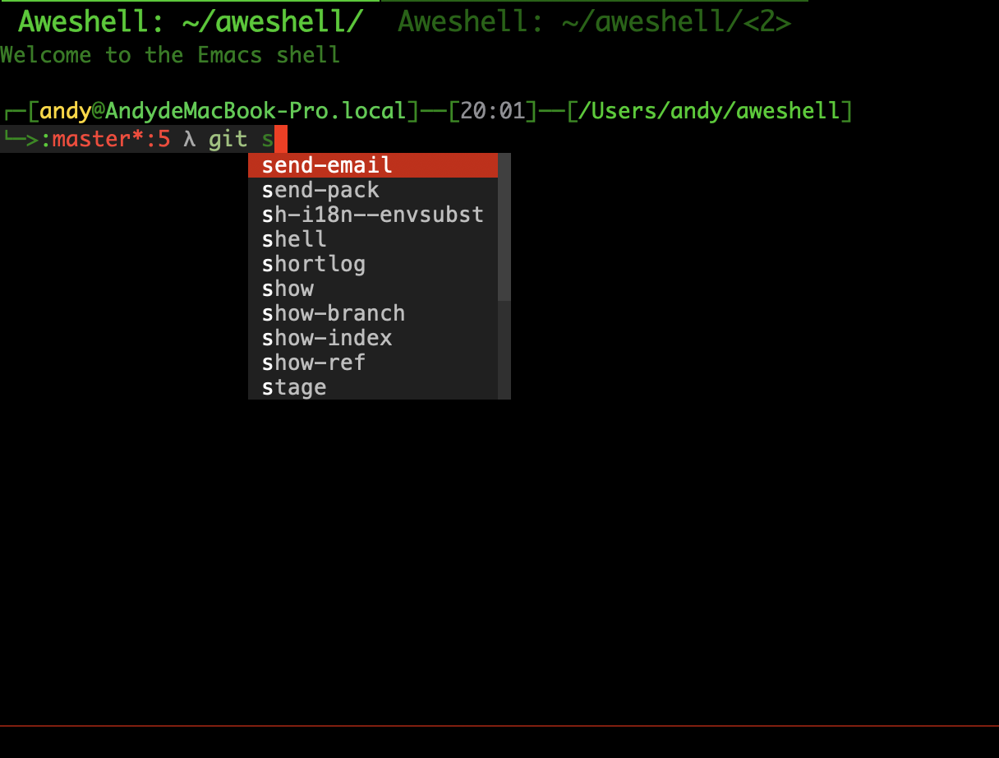

# What is aweshell?

I created `multi-term.el` and use it many years.

Now I'm a big fans of `eshell`.

So I wrote `aweshell.el` to extend `eshell` with these features:

1. Create and manage multiple eshell buffers.
2. Add some useful commands, such as: clear buffer, toggle sudo etc.
3. Display extra information and color like zsh, powered by `eshell-prompt-extras'
4. Add Fish-like history autosuggestions, powered by `esh-autosuggest', support histories from bash/zsh/eshell.
5. Validate and highlight command before post to eshell.
6. Change buffer name by directory change.
7. Add completions for git command.
8. Fix error `command not found' in MacOS.
9. Integrate `eshell-up'.
10. Unpack archive file.
11. Open file with alias e.
12. Output "did you mean ..." helper when you typo.
13. Make cat file with syntax highlight.
14. Alert user when background process finished or aborted.
15. Provide IDE completion feeling for shell command.

# Installation

Put `aweshell.el`, `esh-autosuggest.el`, `eshell-prompt-extras.el`, `exec-path-from-shell.el` to your load-path.
The load-path is usually ~/elisp/.
It's set in your ~/.emacs like this:
```Elisp
(add-to-list 'load-path (expand-file-name "~/elisp"))
(require 'aweshell)
```

Bind your favorite key to functions:

```Elisp
aweshell-new
aweshell-next
aweshell-prev
aweshell-clear-buffer
aweshell-sudo-toggle
```

# Customize

Customize variables below by:
```Elisp
M-x customize-group RET aweshell RET
```

```Elisp
aweshell-complete-selection-key
aweshell-clear-buffer-key
aweshell-sudo-toggle-key
aweshell-use-exec-path-from-shell
```

Customize prompt as directed in [eshell-prompt-extras' README](https://github.com/kaihaosw/eshell-prompt-extras#themes).

Default completion backend ```aweshell-autosuggest-backend``` use ```fish-style```, you can switch to ```company-style``` to enable completion style similar to IDE like below:
```
(setq aweshell-autosuggest-backend "company-style")
```



## Aliases

[eshell-up](https://github.com/peterwvj/eshell-up)

In alias file:
```
alias up eshell-up $1
alias pk eshell-up-peek $1
```

Other customization of eshell-up:
```Elisp
(setq eshell-up-ignore-case nil)
(setq eshell-up-print-parent-dir t)
```
